# 📝 Week 12 - Class notes
## 📅 Date: 09.05.2023.

## AWS Lambda  
### for short running and focused functions

***Lambda*** je AWS *event-driven servis* ciji je osnovni zadatak izvrsavanje **Lambda funkcije** onda kada se desi okidac tj. **trigger** a koji je izazvan dogadjajem koji se desio - **event**.

Lambda servis ce izvristi Lambda funkciju specijalnizovanu za handle-ovanje tog event-a. Dakle, u ovom slucaju **ne znamo gdje se nasa funkcija u pozadini izvrsava**, ali to za nas nije od kljucne vaznosti. 

**Lambda funkcija** je dio koda koji Lambda servis izvrsava.
Kada kreiramo Lambda funkciju, potrebno je da izaberemo jezik u kojem pisemo kod funkcije odnosno **runtime** koji ce funkcija koristiti. Tada se kreira i **runtime enviroment**, okruzenje podeseno na osnovu jezika koji smo izabrali za nasu Lambda funkciju. 

### Runtime enviroment 
**Runtime enviroment** ima svoju memoriju **direct memory** koju alociramo unaprijed pri kreiranju Lambda funkcije, a jedan dio memorije ce biti odvojen za **virtual CPU**. 
* ***Alokacija memorije od 128MB do 1024MB sa 1MB koracima***
* ***1769 MB memorije dodjeljuje 1 vCPU***
Ne mozemo sami izabrati velicinu CPU koju zelimo, vec ce se taj dio odvojiti zavisno od memorije koju smo alocirali. Ovaj nacin dodjele CPU-a je **indirektan**.

* ***Runtime enviroment ima alociranu dodatnu memoriju za fajlove u folderu /tmp - 512 MB, koja moze da se poveca do 10240 MB - dozvoljeno je koristenje ali /tmp folder je prazan pri svakom novom pozivu funkcije jer se tu cuvaju temporary files***

Izborom jezika koji ce biti koristen za izvrsenje koda, odredjuje se i koje komponente ce nam biti dostupne. 

#### :exclamation: *Svaki put kada se Lambda funkcija pozove na izvrsenje, kreira se novi runtime enviroment sa svim potrebnim komponentama koje Lambda funkcija zahtjeva za adekvatno izvrsenje. Kod se ucita, izvrsi i terminira.*

#### *Lambda funkcije su stateless* 
Sto znaci *no data left from pevious invocation*. Nakon svakog novog poziva, pokrece se "cisto" radno okruzenje, bez zaostalih fajlova iz prethodnih poziva. 

### Kako Lambda funkcionise?

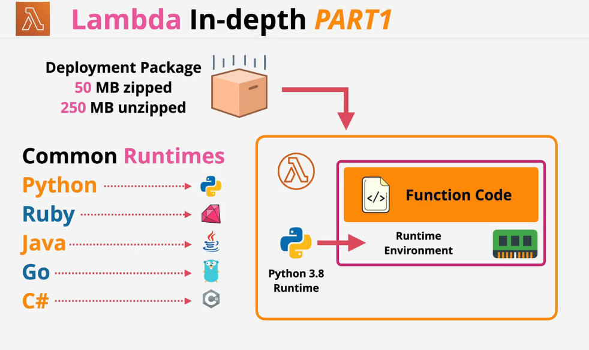
*Slika preuzeta iz video predavanja Learn Cantril SAA*

Lambda funkciju osim kao *samo dio koda* mozemo posmatrati i kao paket koji sadrzi sve potrebne postavke za izvrsenje - **deployment package**. Kada se desi event i Lambda funkcija je pozvana na izvrsenje, deployment paket se preuzme i izvrsi unutar podesenog runtime enviroment-a. 

Na slici su prikazani i neki od jezika koje Lambda funkcija podrzava. 

### :whale:  Docker je anti-pattern za Lambda servis. 
Lambda podrzava koristenje ***Docker image-a*** i drugih image-a, ali u smislu da su to **build procesi** od kojih mozemo kreirati Lambda images. 

### :clock930: Function timeout je 15min/9000s - vrijeme koliko dugo se Lambda funkcija moze izvrsavati.
 Za sve preko 15 min nije moguce koristiti samo Lambda funkciju. Primjer dodatnih servisa su *step functions*.

### :closed_lock_with_key: IAM roles koristimo za kontrolu pristupa drugim servisima i proizvodima.
 Kreiramo *execution role* i zakacimo je za Lambda funkciju.
 ### :moneybag: **AWS ce za Lambda servis naplatiti trajanje izvrsavanja Lambda funkcije.** 

### :bulb: Najcesca upotreba
 * **Serverless applications** -  S3, API gateway, Lambda
 * **File Processing** - S3, S3 Events, Lambda
 * **Database triggers** - DynamoDB, Streams, Lambda
 * **Serverless CRON** - EventBridge/CloudWatch Events + Lambda
* **Realtime stream data processing** - Kinesis + Lambda 

##   Lambda networking
Lambda funkcije imaju 2 **networking modes** - **public** i **VPC** networking.

#### :exclamation::memo: *Defaultno* Lambda funkcije su u *public networking mode*, cime je omogucena komunikacija sa public AWS servisima i public Internetom
**Naravno gledano sa mrezne strane to je moguce, ali samo ako je pristup servisima takodje dozvoljen pomocu authentication i authorization metoda.**

Isto vazi i za servise koji se nalaze unutar nekog VPC-a. Ukoliko servisi imaju dodijeljene Public IP adrese, NACL ili Security groups koje omogucavaju komunikaciju van VPC-a, Lambda moze pristupiti ovim servisima. U suprotnom - to nije moguce. 

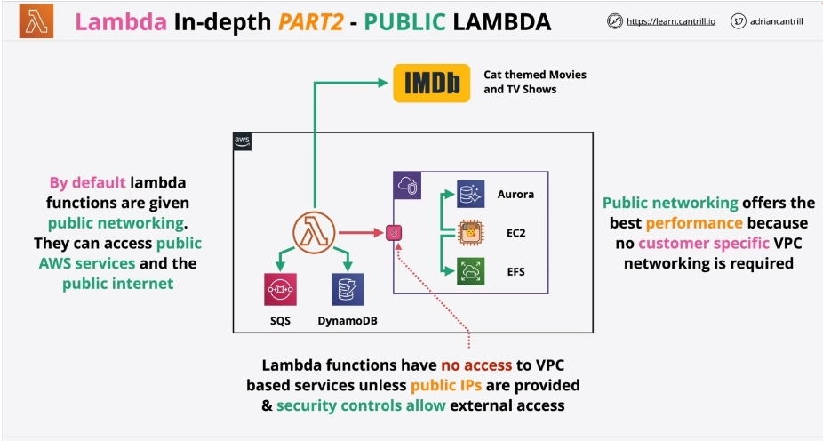
*Slika preuzeta sa learn.cantrill.io SAA*

### :memo: Za Lambda funkcije koje se izvrsavaju unutar VPC -a, vrijede sva VPC pravila i ponasaju se kao svi ostali servisi unutar tog VPC-a.

Kada je Lambda postavljena unutar subneta u VPC-u, moze pristupati svim servisima unutar VPC-a ukoliko je tako regulisano security i policy pravilima. 

Lambda funkcija ne moze slobodno pristupati servisima van VPC-a ukoliko nije drugacije konfigurisano na nivou VPC-a.

* Ako je potreban izlaz van VPC-a mozemo koristiti **VPC Endpoint** - **za pristup public AWS servisima**
* Ako je potreban **izlaz na internet**, koristimo **NAT gateway + Internet Gateway** 

*Slika preuzeta sa learn.cantrill.io SAA*

#### Kako Lambda funkcija ustvari radi unutar VPC-a?

Na slici iznad u dijelu "New way" prikazan je primjer funkcionisanja.
Unutar jednog regiona tj. account-a, kreiraju se dva VPC-a. 
**AWS Lambda Service VPC** gdje su smjestene sve Lambda funkcije, dok imamo i **A4LVPC** sto predstavlja **Customer VPC**. 

#### :older_man: The old way
Prilikom poziva Lambda funkcije na izvrsenje (*invocation*) iz Lambda service VPC, bilo je potrebno da se u Customer VPC kreira ENI (*Elastic Network Interface* slicno mreznoj kartici) kako bi se uspostavio saobracaj izmedju ova dva VPC-a. 
Mana ovog nacina rada jeste sto se javljao veliki delay u prenosu, za svaku Lambda funkciju je bio potreban poseban ENI, lose skaliranje za koje je pri svakom paralelnom izvrsenju ili konkurentom izvrsenju bio potreban dodatni ENI, sto je bilo jako tesko za odrzavati. 

#### :man:  The new way

Naravno, vise nije potrebno zahtjevati ENI pri svakom izvrsenju Lambda funkcije. AWS analizira sve funkcije koje su pokrenute unutar regiona tj. unutar account-a, te pravi jedinstvene kombinacije subneta i security grupa. Za svaku jedinstvenu kombinaciju, zahtjeva se 1 ENI unutar VPC-a. 

Na primjer, ako se  Lambda funkcije nalaze unutar kolekcija koje imaju razlicite subnete ali koriste istu security grupu, onda je potreban 1 ENI/subnet. 
U slucaju da sve funkcije koriste isti subnet i istu security grupu, potreban je samo jedan zajednicki ENI unutar VPC-a. 
Za svaku jedinstvenu kombinaciju subnet, security grupa kreira se posebna veza izmedju Lambda VPC i Customer VPC. 
To se dešava samo jednom, pri konfiguraciji Lambda funkcije i trajanje inicjalnog setup-a je 90s.
Kasnije, ako zelimo nesto promjeniti jednostavno uradimo Update i nema potrebe za ponovnim uspostavljanjem novih veza. 

##   Lambda Permissions

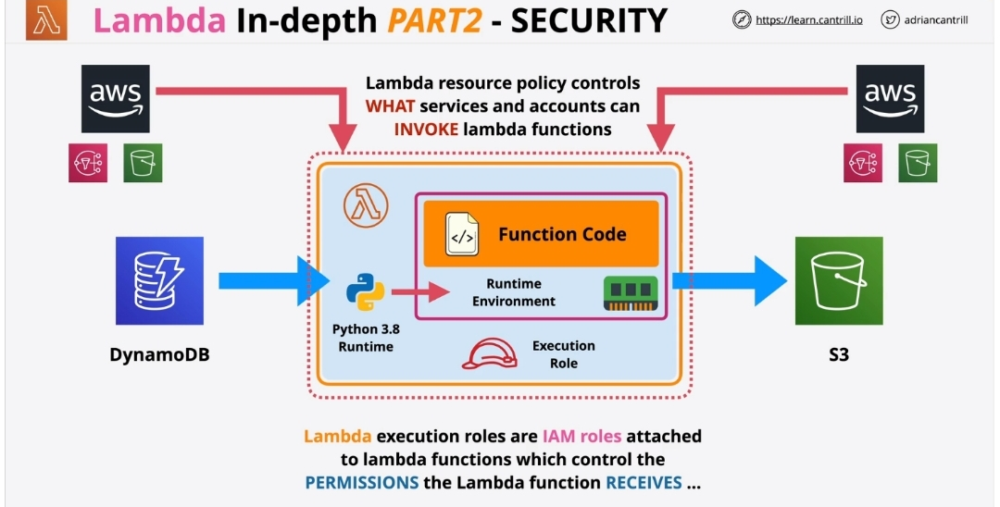
*Slika preuzeta sa learn.cantrill.io SAA*

Kako bi runtime enviroment ili radno okruzenje imalo pristup AWS proizvodima i servisima, moramo kreirati Execution role koju zakacimo za nasu Lambda funkciju. 

Lambda permissions - 2 kljucna dijela:
1. Roles permission policy, koji se odnosi na kod koji Lambda pokrece, a koji preuzima od Lambda funkcije premisije definisane za tu rolu. Ovim se kreiraju privremeni kredencijali koje Lambda funkcija koristi za pristup servisima. 
2. Trust policy, koji vjeruje Lambda funkciji 

#### :memo: Lambda Execution roles su IAM role zakacene za Lambda funkcije, cime se kontrolisu permisije koje funkcija prihvata

#### :memo: Lambda Resource policy koji kontrolise KOJI servisi i accounts mogu raditi INVOKE poziv Lambda funkcije
Nesto slicno kao S3 bucket policy. 
Moze se rucno promijeniti pomocu CLI ili API, ali ne i preko Console UI. 

##   Lambda Monitoring

Lambda koristi **Cloud Watch, Cloud Watch Logs i X-Ray** za pracenje logging-a i sami monitoring.

* **Logovi** koji nastaju pri izvrsenju Lambda funkcije **smjestaju se u** **CloudWatch Logs**
* **Metrika** - detalji o uspjesnom invoke-u funkcije, failure error, retries, latency s**mjestaju se u CloudWatch**
* **Distributed tracing** - Lambda se integrise sa **X-Ray**, u slucajevima kada zelimo pratiti putanju do korisnika, putanju sesija unutar serverless aplikacija koje koriste Lambdu.

#### :memo: Kako bi Lambda mogla da cuva logove unutar CloudWatch Logs mora imati permisije definisane unutar Execution role

## Lambda invocation

Postoje tri nacina da se uradi invoke Lambda funkcije:
1. Synchronous invocation
2. Asynchronous invocation
3. Event Source mappings

### Synchronous invocation

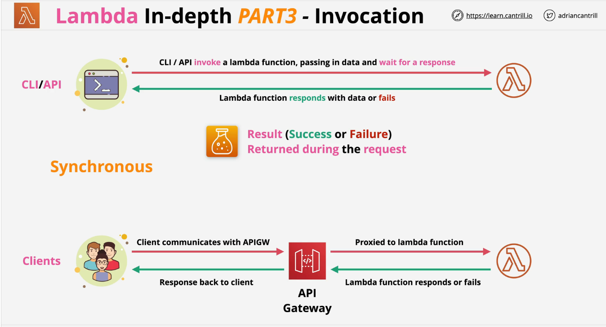
*Slika preuzeta sa learn.cantrill.io SAA*

**Synchronous invocation** ili sinhroni poziv lambda funkcije podrazumijeva da klijent pomocu CLI ili API posalje zahtjev ka Lambda funkciji. Lambda funkcija ce da se "probudi" iz stanja cekanja, obradi zahtjev tj. izvrsi kod namijenjen za taj event koji se desio i posalje klijentu nazad podatke koji se zahtjevaju. Obicno je to poruka o uspjesno zavrsenom izvrsenju funkcije ili fail-u. 
* Sve vrijeme dok Lambda funkcija izvrsava kod, klijent ceka na odgovor.
* Svi error-i koje dobijemo kao odgovor i eventualni ponovni pokusaji moraju biti odradjeni od strane klijenta jer Lambda funkcija se probudi iz stanja cekanja, izvrsi kod i stane. 

#### :memo: Synchronous invocation koristi se kada covjek tj. klijent direktno utice na invoking Lambda funkcije. Klijent salje zahtjev i sve vrijeme dok traje izvrsenje Lambda funkcije, ceka odgovor. Ako je odgovor greska ili zahtjeva ponovno slanje zahtjeva, klijent je u obavezi da to rucno uradi. 

### Asynchronous invocation

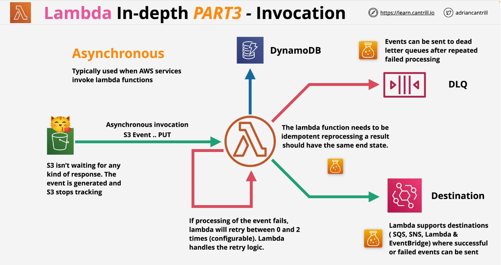
*Slika preuzeta sa learn.cantrill.io SAA*

**Asynchronous invocation** ili asinhroni poziv lambda funkcije podrazumijeva da AWS servisi rade invoke Lambda funkcije. 
* Servis ne ceka da Lambda funkcija vrati odgovor
* Svi error-i koje dobijemo kao odgovor i eventualni ponovni pokusaji moraju biti odradjeni od Lambda funkcije. Broj pokusaja je 0 do 2. 
*  Kod mora biti ***idempotent*** sto znaci da moramo omoguciti da kod daje isti rezultat operacije ili da ima isti *end state* prilikom re running-a. 
* Events mogu biti poslati u **Dead letter queue** nakon nekoliko bezuspjesnih pokusaja. 
* Lambda ima mogucnost kreiranja destinacija, sto znaci da eventi koji su obradjeni od strane Lambda funkcije i imaju povratne informacije, one mogu biti poslate na drugu destinaciju tj. ka drugim servisima kao npr. SNS, SQS, Lambda ili Event Bridge. 

### Event Source mapping

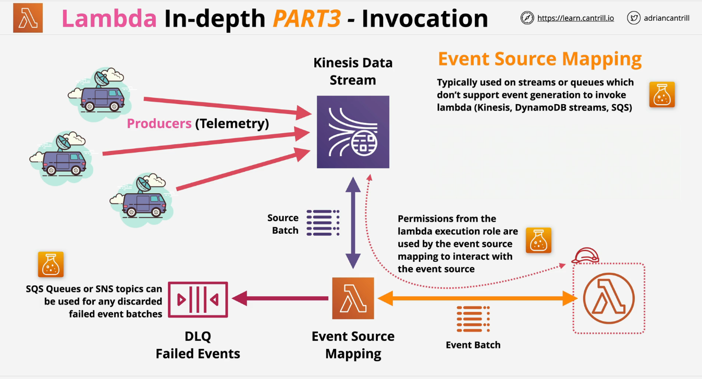
*Slika preuzeta sa learn.cantrill.io SAA*

**Event Source mapping** koristimo u slucaju kada imamo Streams ili Queues koji nemaju mogucnost generisanja eventa koji bi trigerovali pokretanje Lambda funkcije (Kinesis, DynamoDB streams, SQS) - **eventi kod koji zahtjevaju polling tj. povlacenje podataka iz reda**

* **Kinesis Data stream** je Stream-based proizvod, koji omogucava korisnicima da citaju iz Stream-a, ali nema generisanja dogadjaja kada se doda novi podatak u Stream. 

Kako bismo koristili Kinesis Data stream u kombinaciji sa Lambda funkcijom potreban nam je **Event Source mapping** servis koji radi polling podataka iz Stream-a, trazi nove podatke i vraca nazad **Source batches**.  Batch podaci su podijeljeni po velicini batch-a i poslati Lambda fuknciji kao **Event batches**. 
* Lambda pri jednom invoke-u moze primiti stotine event-a u obliku batch-a, ali zavisi od toga koliko je potrebno da obradi svaki event jer je limitirana na 15 min timeout. 

#### :memo: Kod Asinhronih poziva Lambda funkcije, nisu potrebne permisije za pristup izvornom servisu jer on samostalno triggeruje izvrsenje Lambda funkcije, osim u slucaju kada je potrebno preuzeti jos informacija od izvornog servisa. 
Na primjer, kada dodajemo sliku u S3 bucket, nakon sto se doda slika, S3 servis ce sam da odradi invoke proces slanjem podataka o dodatoj slici ka Lambda funkciji. Lambda ukoliko zeli dodatne informacije o objektu, mora imati potrebne permisije za pristup. 

#### :memo: Pri koristenju Event Source mapping izvorni servis ne radi direktni invoke Lambda funkcije. ES mapping cita podatke iz izvornog servisa koristeci Lambda Execution role permisije da bi pristupio tim podacima. Tako da se ES mapping koristi samo kao posrednik u ime Lambda funkcije i koristi njene permisije iz Execution roles kako bi prikupio potrebne podatke. 

* Batches koji imaju konstantan *fail* salju se u Dead Letter Queue i prosljedjuju preko SNS ili SQS servisa na dalju obradu. 

## Lambda versions

* Lambda funkcije mogu imati svoje verzije koda - ***v1,v2,...***
* Verzija je kod + konfiguracija Lambda funkcije
* Kada objavimo verziju Lambda funkcije ona je ***immutable*** - ne mijenja se od momenta kada je objavljena i ima svoj Amazon Resource Name i **nije moguce mijenjati tu verziju**
* `$Latest` pokazuje na posljednju/najnoviju verziju Lambda funkcije i mijenja se u skladu sa objavljivanjem novih verzija - ***not-immutable***
* **Aliases** - mozemo kreirati aliase (DEV, STAGE, PRODUCTION) koji ce da pokazuju na neku verziju Lambda funkcije, pokazujuci time faze razvoja. Aliasi se mogu mijenjati te su ***not-immutable***

#### :memo:Pri deploymentu Lambda funkcije, kada se radi o vecim skaliranjima, kreiramo verzije Lambda funkcije za sve veće promjene te koristimo aliase za razlicite komponente serverless aplikacije koji pokazuju na immutable verzije Lambda funkcije. 

## Lambda startup times

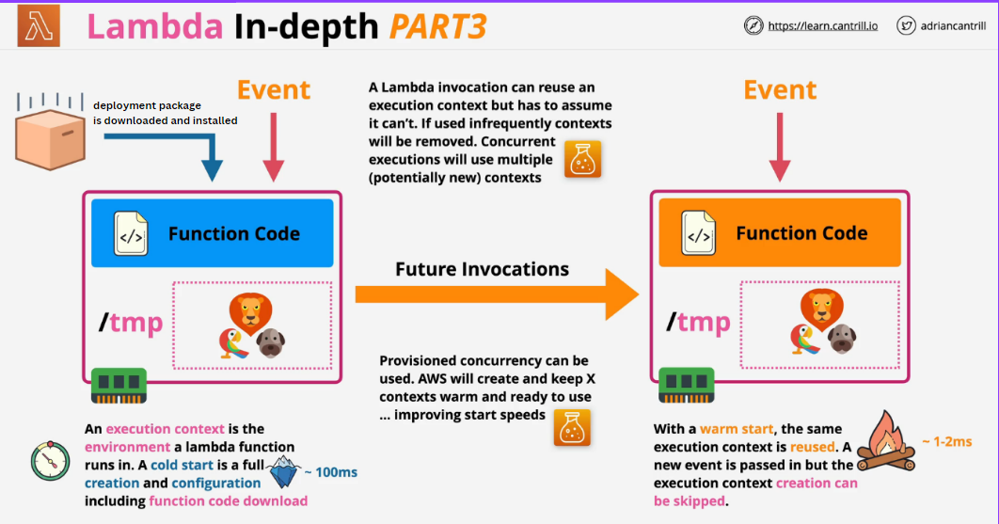
*Slika preuzeta sa learn.cantrill.io SAA*

* ***Cold start*** desava se pri prvom "pokretanju" Lambda funkcije, kada je potrebno da se postavi adekvatno okruzenje, instaliraju potrebni paketi i odradi sve potrebno za efikasno izvrsenje Lambda funkcije tj. njenog koda. Za ovo je potrebno **~ 100ms** 
* ***Warm start*** svaki sljedeci poziv Lambda funkcije, nece zahtjevati ovoliko vremena, jer su sve pocetne  postavke sacuvane u **execution context**. Context sada samo prihvati event i odmah pocinje obradu. Za ovo je potrebno **~ 1-2ms**

***Voditi racuna da izmedju poziva Lambda funkcije ne prodje mnogo vremena, jer u suprotnom ce podaci biti obrisani iz execution context-a i ponovo cemo morati cekati cold start da se odradi build.***

***1 execution context / invocation*** sto znaci da ako u trenutku zahtjevamo 20 invokacija Lambda funkcije, imacemo 20 cold start-ova. 

* Kako bismo rijesili ovaj problem, preporuka je da se koristi **Provision concurrency** onda kada znamo da nam predstoji high load invokacija nad Lambda funkcijom, kao i kada se planira product release kako bi se poboljsale performanse. 

* Takodje moguce je u execution context-u kreirati `/tmp` prostor za temporary files, te ukoliko neka druga funkcija koristi isti context imace odmah pristup tim fajlovima.

#### :memo: Sve sto se definise unutar Lambda function handler-a postoji samo u toku te invokacije Lamda funkcije. 

Sve sto smatramo da bi bilo korisno da se ponovo koristi kao resurs, mozemo kreirati van Lambda function handler-a i bice dostupno za sve ostale pozive Lambda funkcije. Voditi racuna da funkcije ipak ne zahtjevaju te resurse i da nisu svjesne postojanja istih , vec da budu spremne da ponovo sve kreiraju kako ne bismo imali problem ako se dogodi neki fail ili nemogucnost pristupa resursu. 

## Amazon Event Bridge, CloudWatch Events
## CloudWatch Events

**CloudWatch Events** dostavljaju *stream* ili veci broj eventa koji su se desili nekim od AWS servisa, sto se desava skoro pa real-time uz mali delay. Na primjer, CW Events mozemo koristiti da obavjesti Lambda funkciju da se desilo terminiranje EC2 instance  i treba nesto poduzeti. 
* Postoji **samo jedan** Event Bus koji nije prikazan unutar User Interface-a, iako smo u interakciji s njim kada trazimo evente i saljemo te evente ka target servisima kada zelimo da se nesto desi 

## Amazon EventBridge

**EventBridge** ima iste funkcionalnosti kao i CloudWatch Events uz dodatnu mogucnost hendlovanja eventima od strane third-parties application ili custom application.  Iz ovih razloga, preporuka je da se polako krene u migraciju sa CW Events na EventBridge. 
* Pored defaultnog Event Bus-a, mozemo kreirati dodatne bus-ove bilo da su namijenjeni nasoj aplikaciji ili third-parties aplikacijama 

## Kljucni koncepti

#### Ako se desi X, Y puta... uradi Z
* **X** predstavlja servis koji kreira event **producer of an event**
* **Y** broj puta koliko se nesto desilo  ili period vremena, za specifikaciju koristimmo UNIX cron format koji omogucava da specificiramo jedan ili vise puta kada se nesto treba desiti
* **Z** je target servis kojem se dostavlja event da se dogadjaj X desio 

* Oba servisa imaju istu baznu arhitekturu, koriste default entity - ***Event Bus***, te imaju default event bus za AWS account

***Event Bus*** mozemo zamisliti kao pokretnu traku sa koferima na aerodromu. Gdje bi koferi predstavljali evente, aerodrom je nas AWS account, putnici su AWS servisi koji preuzimaju evente, a stuff aerodroma su AWS servisi koji dostavljaju evente. Na traku, stuff postavlja kofere na kojima pisu podaci o putniku, traka nosi kofere, a putnik kada prepozna svoj kofer i podatke uzima svoj kofer sa trake i odlazi. 
Na slican nacin EventBridge prihvata evente od servisa unutar AWS accounta, nosi te evente, a servisi koji budu obavjesteni da im stize event, rade polling tog eventa sa trake i vrse dalju obradu. 

* Kod oba servisa kreiramo *rules* koji odgovaraju sablonima eventa koji dolaze u bus, kada se prepozna unutar bus-a event, odgovarajuci rule salje event dalje ka target servisu 
* Mozemo uraditi i schedule rules, kako bismo podesili sablone eventa koji se desavaju u neko specificno vrijeme i za to ponovo koristimo UNIX CRON system 

*Slika preuzeta sa learn.cantrill.io SAA*

## Amazon Simple Queue Service (SQS)

SQS - Simple Queue Service nam pruza upravljanje redovima (queues) poruka. To je public service, znaci da je dostupan bilo gdje sa AWS public space endpoints pristupom. 
To ukljucuje privatni VPC ako ima konektivnost ka servisima. U potpunosti je upravljiv, npr. **kreiramo queue i onda servis dostavlja taj queue kao servis**.
Queues su HA (highly available), tako da ne moramo da brinemo o replikaciji i izdrljivosti. 
Postoje dva tipa queues-a: 

- Standard queues - najvise se koristi, ali postoji mogucnost da ne dobijemo poruke organizirano.

- FIFO queues - pruza i garantira nam da poruke dolaze organizirano, i kada dobijemo poruke, vidimo ih organizirano, **npr. poruka 1, poruka 2, poruka 3...**.

Posmatrajmo Standard queues kao autoput sa vise traka, dok je FIFO queues kao put sa jednom trakom bez prilike da bilo koga preteknemo. 
Standard queues nam garantira barem jednu isporuku ali ne garantira order te isporuke. Sa standardnim queues mozemo dobiti istu poruku dostavljenu 2x i order moze biti drugaciji. 
FIFO nam garantira order i isporuku tacno jednom. 

*Slika preuzeta sa learn.cantrill.io SAA*

- FIFO (Performanse) 3000 poruka po sekundi sa batchingom ili 300 u sekundi bez

- Naplacuje se po 'requestu', 1 request = 1-10 poruka do 64 KB

- Short (odmah) vs Long (waitTimeSeconds) Polling - vise o ovome mozete procitati [ovdje](https://docs.aws.amazon.com/AWSSimpleQueueService/latest/SQSDeveloperGuide/sqs-short-and-long-polling.html)

- Posto poruke mogu zivjeti neko vrijeme u queues-u, produkt podrzava **at rest** KMS enkripciju (kada je spremljena na diskove Amazon SQS data centra) i **Transit** (kada putuje do i od Amazon SQS)

- Queue policy - pristup queue je baziran na identity policies, ali moze se koristiti i queue policy kako bi se kontrolirao pristup sa istog accounta, dok queue policy se moze jedino koristiti kako bi se dodao pristup sa vanjskog ili external accounta. 

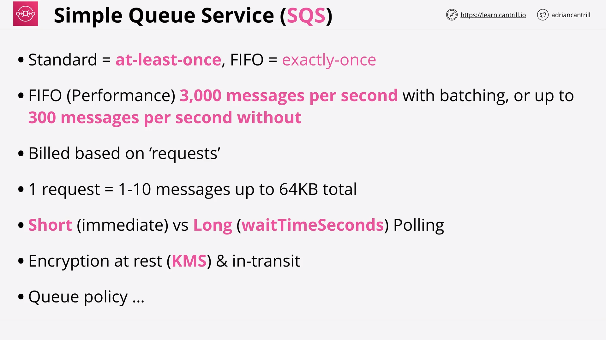
*Slika preuzeta sa learn.cantrill.io SAA*

# 

- Poruke koje se dodaju u queue, mogu biti do 256 KB. 

- Primljene poruke su skrivene (visibility timeout). Npr. kada klijent primi i obradi poruku iz queue, poruka ostaje u queue. SQS ne brise automatski poruku. Buduci da je Amazon SQS distribuirani sistem, nema garancije da ce klijent zaista primiti poruku (npr. zbog problema sa konekcijom ili problema u klijentskoj aplikaciji). Zato, klijent mora izbrisati poruku iz queue nakon sto je primi i obradi. Vise o tome mozete procitati [ovdje](https://docs.aws.amazon.com/AWSSimpleQueueService/latest/SQSDeveloperGuide/sqs-visibility-timeout.html).

- Dead-Letter queues je queue gdje se problemi s porukama mogu pomjeriti, npr. ako se poruke prime 5 ili vise puta i nikada se uspjesno ne izbrisu, jedan moguci izlaz iz toga je da se pomjere poruke u Dead-Letter queue. Vise o tome mozete procitati [ovdje](https://docs.aws.amazon.com/AWSSimpleQueueService/latest/SQSDeveloperGuide/sqs-dead-letter-queues.html)

- Queues su odlicni za skaliranje. Auto scaling grupe mogu da skaliraju u zavisnosti od a Lambda moze biti pozvana kada se poruka pojavi u queue i to nam omogucava da napravimo **Worker pool style architecture**.  

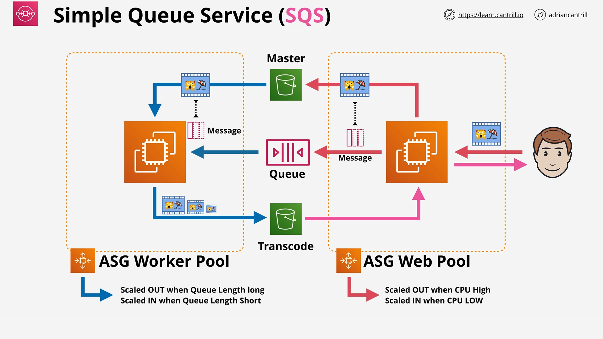
*Slika preuzeta sa learn.cantrill.io SAA*

**POGLEDATI `FANOUT DESIGN`  OD 08:53 U VIDEU  `Simple Queue Service` NA CANTRILLU PA DO 10:46 - BITNO ZA EXAM**

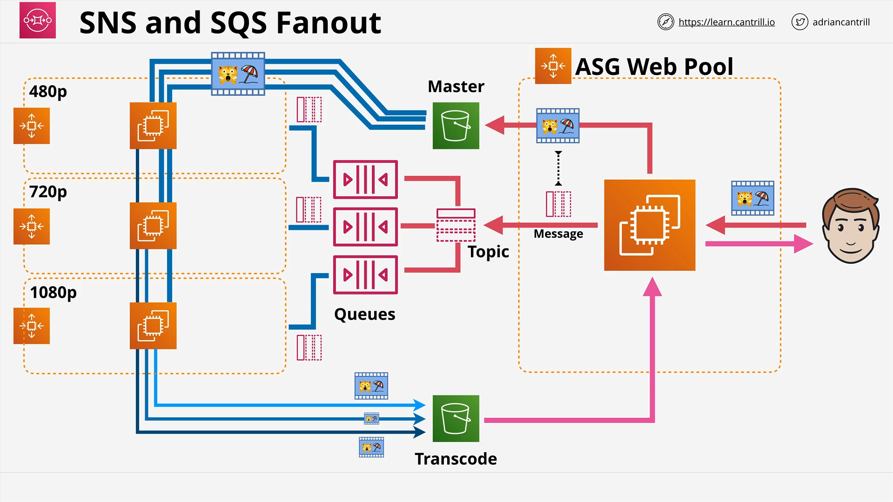
*Slika preuzeta sa learn.cantrill.io SAA*

###  SQS Delay Queues

"Delay queues omogucavaju odgadjanje isporuke novih poruka potrosatima na odredjeni broj sekundi, npr. kada potrosacka aplikacija treba dodatno vrijeme za obradu poruka. Ako kreirate delay queue, sve poruke koje posaljete u queue ostaju nevidljive za potrosace tijekom trajanja vremenskog razdoblja kasnjenja. Zadano (minimalno) kasnjenje za queue je 0 sekundi, a maksimalno je 15 minuta." Vise o ovom, mozete procitati [ovdje](https://docs.aws.amazon.com/AWSSimpleQueueService/latest/SQSDeveloperGuide/sqs-delay-queues.html)

*Slika preuzeta sa learn.cantrill.io SAA*

#

**PRIMJER KORISTENJA SQS-a**

U SQS Queue nece se slati logovi, za to mozes koristimo CloudWatch logs group ili s3, unutar SQS-a idu "messages" nad kojima je potrebna neka akcija/radnja/intervencija da se uradi:

Korisnik uploaduje klip kvalitete 480, mi proslijedimo tu poruku (video je ocigledno prevelik da bi stao unutar Queue-a, ali svaka poruka ima svoj metadata koji bi pokazivao npr. da se video nalazi na s3 bucketu odakle ga moze preuzeti Lambda, EC2 instanca odnosno endpoint koji obradjuje/pooluje poruke iz Queue-a, a ciji je zadatak recimo da napravi verzije 720 i 1080 video snimka).
SQS se primarno koristi da se arhitektura decoupluje, odnosno da se stvori asynchronous nacin rada komponenti, gdje jedan komponenta sistema ne ovisi o drugoj, jedna pushuje messages u SQS, a druga pooluje messages, ta dva sistema prakticno ni ne znaju jedan za drugoga i najvaznije ne cekaju na response sto cini citav sistem mnogo brzim.
SNS se vise koristi kada zelimo da alertujemo/obavijestimo u real time-u vise subscribera (aplikacije, kompontente u sistemu, ljude etc), monitoring (kada je doslo da breach-a nekog alarma/budgeta, pada nekog servisa etc). Prakticno da obavijestimo da se desilo nesto, da bi se (ne mora, moze biti samo obavjestenje neko, npr. saljes korisnicima push notifikaciju da je black Friday 50% off cijena) moglo nesto uraditi povodom toga.

## Amazon Simple Notification Service (SNS)

SNS je **kljucna** komponenta mnogih arhitektura u AWS-u. 

SNS je **visoko dostupan, trajan, siguran, pub-sub messaging servis**. Vise o pub-sub servisu mozete pogledati [ovdje](https://aws.amazon.com/what-is/pub-sub-messaging/)

- Potreban nam je network connectivity sa javnim AWS endpointom kako bi pristupili SNS-u. 

- Koordinacija slanja i primanja poruka. 

- Poruke su sadrzaji velicine do **256 KB**.

- **SNS Topics su glavni entitet SNS-a** - Tu se permisije kontroliraju kao i vecina konfiguracija koja se definira. 

- Publisher salje poruke u TOPIC. 

- TOPICS imaju Subscribere i oni po defaultu primaju sve poruke koje se salju u TOPIC. 

- Subscriberi mogu da dodju u vise formi: HTTP(s), e-mail (JSON), SQS, Mobile Push, SMS poruke i Lambda . 

*Slika preuzeta sa learn.cantrill.io SAA*

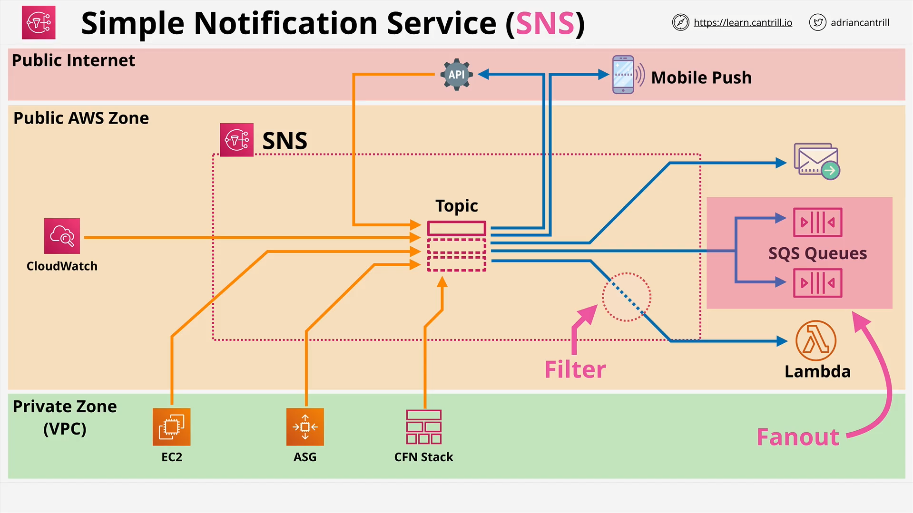
*Slika preuzeta sa learn.cantrill.io SAA*

#

**HTTP(s)**: omogucuje slanje notifikacija putem HTTP(s) protokola. To je URL endpoint koji će primiti HTTP zahtijev sa sadrzajem notifikacije. Ova forma je veoma korisna kada bismo zeljeli da notifikacije stignu do web aplikacije.

**E-mail (JSON)**: salju se notifikacije putem e-maila. Npr. navodi se adresa subscribera i onda notifikacija bude isporucena u JSON formatu putem e-mail poruke. 

**SQS (Simple Queue Service)**: SNS omogucuje integraciju sa SQS. Moze se subscribe-ati SQS queue na SNS topic, tako da svaka notifikacija bude dostavljena u queue kao poruka. 

**Mobile Push**: salju se notifikacije putem mobilnih push servisa. Uradi se subscribe mobilne aplikacije na SNS topic, a notifikacije će biti dostavljene putem push servisa na uredjajima korisnika.

**SMS poruke**: moze se pretplatiti telefonski broj kao subscriber, a notifikacija će biti isporucena kao SMS poruka. 

**Lambda**: SNS moze pozvati cak Lambda funkciju kao subscribera. Kada se notifikacija posalje na SNS topic, Lambda funkcija će biti automatski pokrenuta i moci ce obraditi notifikaciju na zeljeni način. 

# 

SNS se koristi u mnogo AWS produkta i servisa, npr. **CloudWatch** koristi SNS kada alarmi promijene stanje, **CloudFormation** koristi SNS kada stacks promijene stanje. **Auto-Scaling grupa** moze biti konfigurisana da salje notifikacije u TOPIC kada se scaling eventi javljaju. 

Funkcionalnosti koje pruza SNS su veoma bitne. SNS pruza: 

- Status isporuke (delivery status) - HTTP(s) Lambda, SQS

- Ponovni pokusaji isporuke (delivery retries)

- Visoko dostupan i skalabilan (region) - svi podaci koji se posalju u SNS se repliciraju u regiji

- Server side enkripcija (SSE)

- Mogucnost cross-accounta kroz TOPIC policy

**SNS se opsezno koristi kada se deploya projekt u AWS**

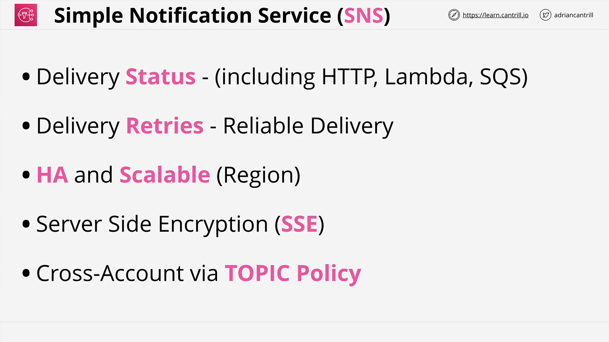
*Slika preuzeta sa learn.cantrill.io SAA*

## Amazon API Gateway

- API Gateway omogucava kreiranje i upravljanje APIs (engl. *Application Programming Interface*). API predstavlja softverski mehanizam koji pojednostavljuje *development* na nacin da radi apstrakciju detalja implementacije, prikazuje samo one detalje i objekte koji su potrebni developeru, te uspostavlja nacin komunikacije izmedju pruzatelja usluge i korisnika.

- API Gateway je *highly available* i *scalable* servis.

- **API Gateway Endpoint types**
1. *Regional* - klijenti se nalaze u istoj regiji
2. *Edge-optimized* - koristi CloudFront
3. *Private* - moze se koristiti samo unutar VPC

- **RESTful API Gateway**
1. *REST API*
    - developer ima punu kontrolu nad zahtjevima i odgovorima
2. *HTTP API*
    - jednostavniji i jeftiniji za koristenje
    - manje kasnjenje
    - ne pruzaju mogunosti potpune kontrole nad zahtjevima i odgovorima

- **Autorizacija i autetifikacija API Gateway**
1. *None* - otvoreni pristup
2. *IAM* - koristenje *IAM* servisa i *IAM Credentials* za pristup
3. *JWT* - JSON Web Tokens se koriste u pozadini za provjeru autenticnosti zahtjeva kada se koristi OpenID Connect ili OAuth 2.0. REST APIs mogu koristiti Amazon Cognito kao JWT *authorizer*. 
4. *Lambda authorizers* - koristi se lambda funkcija za provjeru tokena ili se zahtijevaju parametri za odobravanje pristupa

- **Monitoring tools**
1. *CloudWatch* - po *default*-u API Gateway svaku minutu salje odredjene metrike prema *CloudWatch* servisu
2. *AWS X-Ray* - prati i analizira zahtjeve *end-to-end*
3. *AWS Config* - procjena i pregled azuriranja konfiguracije
4. *AWS CloudTrail* - upravlja pozivima koji su upuceni prema API Gateway-u od strane korisnika, role ili nekog drugog AWS servisa.

## 📹 Session recordings
- [**WEEK-12-tier-1-group-1 video session recording**](https://youtu.be/xEhI5pEvgXM)
- [**WEEK-12-tier-1-group-2 video session recording - PART I**](https://youtu.be/Fb6R3YXPxv0)  
- [**WEEK-12-tier-1-group-2 video session recording - PART II**](https://youtu.be/xysv_eSb1tQ)  

## 📖 Reading materials

[:fast_forward: Class Notes](/devops-mentorship-program/05-may/week-12-090523/00-class-notes.md)
[:fast_forward: Additional Reading](/devops-mentorship-program/05-may/week-12-090523/02-additional-reading.md)
[:fast_forward: HOME - README.md](../../../README.md)
[:fast_forward: Sadrzaj - DevOps Learning Path](../../../table-of-contents.md)
